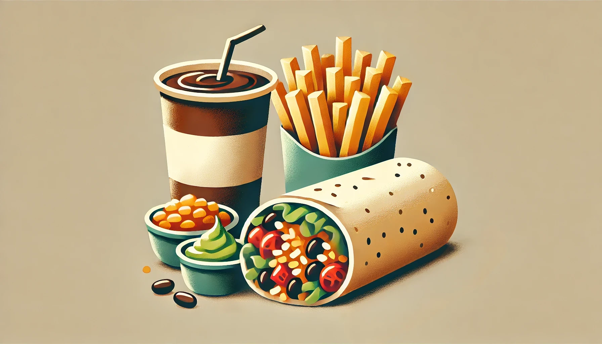

# The Proper Way to Structure Your SwiftUI Code: Introducing the Wrap Code Method

**From Chaos to Clarity: A Practical Guide to Structuring SwiftUI Code**



Imagine this: You open an old SwiftUI project, and within moments, you're lost in a labyrinth of unorganized code. Sounds familiar? Don't worry—you're not alone. Whether you're a senior developer or just starting out, writing clean, maintainable code can be challenging.

If you've been coding for a while, chances are you've come across some messy projects where everything was unorganized and hard to maintain. A clean structure helps you stay productive and makes your codebase maintainable in the long run.

## What's the Wrap Code Method?

The **Wrap Code Method** is a simple yet effective approach to organizing your SwiftUI code in a clean and maintainable way. Inspired by the structure of a wrap (think burritos, tacos, gyros, or shawarma), this method categorizes your code components to make them easier to manage and understand.

## Why Is This Method Important?

SwiftUI's declarative nature can make even simple views cluttered. As your views grow in complexity, state management, layout, modifiers, and functions can become entangled, leading to a chaotic codebase. The Wrap Code Method provides a structured way to manage this complexity by breaking down your code into distinct sections.

## How Can It Help You?

- **Improves Readability**: Quickly understand each part of your view, making collaboration and revisiting your project easier.
- **Enhances Maintainability**: Easily modify and debug a well-structured codebase.
- **Facilitates Reusability**: Reuse clean, modular components across different projects.
- **Reduces Errors**: Prevent bugs with clear separation of concerns.

---

## What's in a Wrap?

Think of your code like a wrap, where all components are neatly organized:

- **Tortilla**: The outer shell that wraps your view (`View` struct).
- **Ingredients**: Foundational elements like `State`, `Environment`, and properties.
- **Fillings**: The main content inside the tortilla (`body` of your SwiftUI view).
- **Sauces**: Modifiers that add extra flavor (e.g., `.padding()`, `.background()`).
- **Extras**: Helper functions and extensions for additional functionality.

---

## How to Implement It

### 1. Tortilla (Main View Wrapper)
The `View` struct acts as the outer shell, wrapping everything inside:

```
struct ContentView: View {
    var body: some View {
        // Your main layout goes here
    }
}
```

---

### 2. Ingredients (State, Environment, Properties)
Properties form the foundation and manage the view's state and behavior:

```
@State private var isToggled: Bool = false
@Environment(\.presentationMode) var presentationMode
```

---

### 3. Fillings (Body)
The main content of your wrap:

```
var body: some View {
    VStack {
        wrapTitle
        toggleSwitch
        actionButton
    }
    .padding()
}

// MARK: - Fillings (Body Components)
extension ContentView {
    var wrapTitle: some View {
        Text("Hello, SwiftUI!")
            .font(.largeTitle)
            .padding()
    }
    
    var toggleSwitch: some View {
        Toggle(isOn: $isToggled) {
            Text("Toggle Option")
        }
        .padding()
    }
    
    var actionButton: some View {
        Button(action: closeView) {
            Text("Close")
        }
    }
}
```

---

### 4. Sauces (Modifiers)
Modifiers fine-tune the appearance and layout, just like sauces enhance flavor:

```
.padding()
.background(Color.gray.opacity(0.2))
.cornerRadius(10)
```

---

### 5. Extras (Helper Functions & Extensions)
Helper functions add extra functionality without cluttering the main view:

```
func closeView() {
    presentationMode.wrappedValue.dismiss()
}
```

---

## Final Look at the Wrap Code Method

Here’s the complete code:

```
import SwiftUI

// MARK: - Tortilla (Main View Wrapper)
struct ContentView: View {
    
    // MARK: - Ingredients (State, Environment, Properties)
    @State private var isToggled: Bool = false
    @Environment(\.presentationMode) var presentationMode
    
    // MARK: - Fillings (Body)
    var body: some View {
        VStack {
            wrapTitle
            toggleSwitch
            actionButton
        }
        // MARK: - Sauces (Modifiers)
        .background(Color.gray.opacity(0.2))
        .cornerRadius(10)
        .padding()
    }
}

// MARK: - Fillings (Body Components)
extension ContentView {
    var wrapTitle: some View {
        Text("Hello, SwiftUI!")
            .font(.largeTitle)
            .padding()
    }
    
    var toggleSwitch: some View {
        Toggle(isOn: $isToggled) {
            Text("Toggle Option")
        }
        .padding()
    }
    
    var actionButton: some View {
        Button(action: closeView) {
            Text("Close")
        }
    }
}

// MARK: - Extras (Helper Functions)
extension ContentView {
    func closeView() {
        presentationMode.wrappedValue.dismiss()
    }
}

// MARK: - Extras (Preview)
struct ContentView_Previews: PreviewProvider {
    static var previews: some View {
        ContentView()
    }
}
```

---

## Give It a Try!

Implement the **Wrap Code Method** in your next SwiftUI project and see how it transforms your workflow. Your future self (and your team) will thank you for having such clean, maintainable, and scalable code.

**Happy coding, and enjoy your Wrap!**

---

**If you found this method helpful, feel free to star this repo and share it with fellow developers! Want to share your thoughts?**
